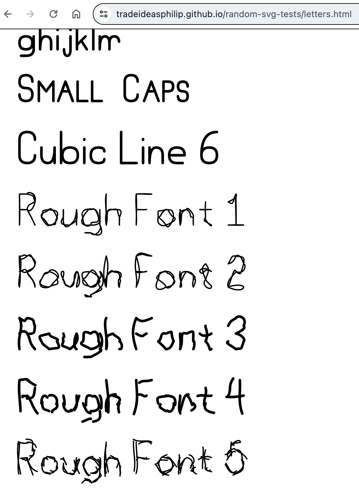
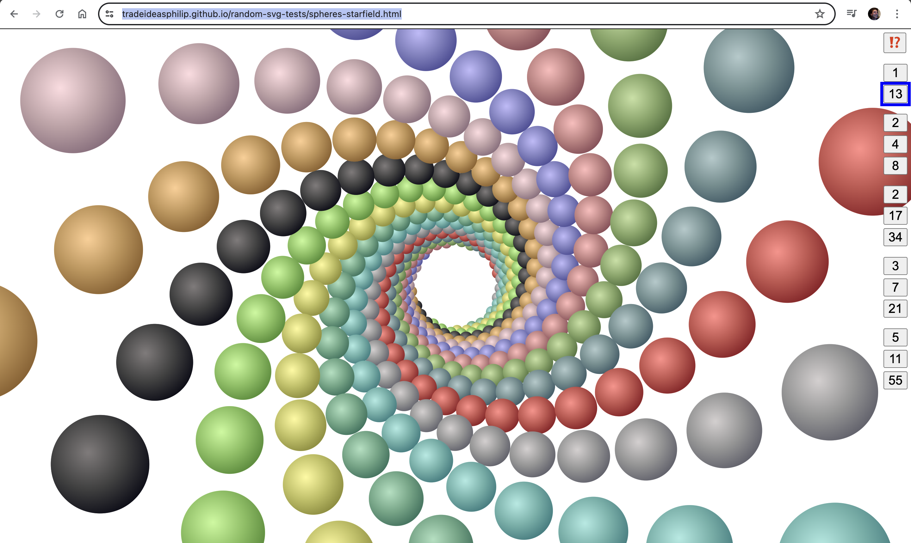
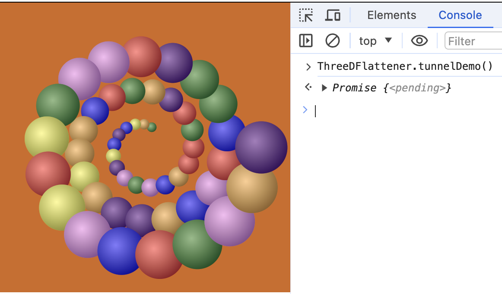
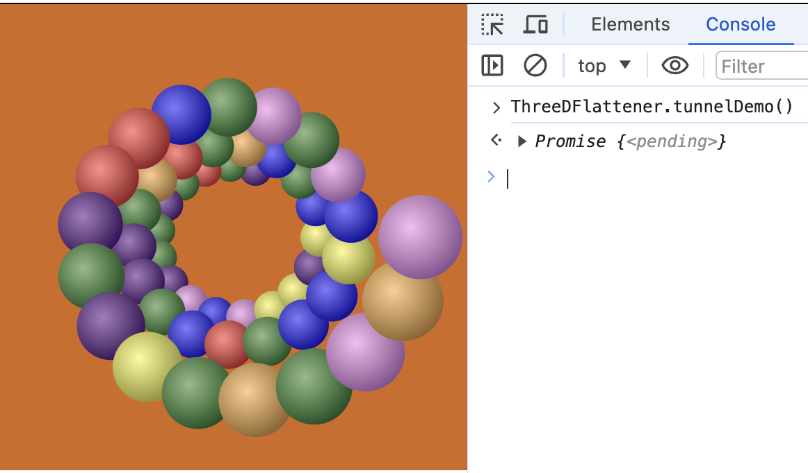

# Random SVG Tests

I'm having fun.
It's nice to have a place to doodle.
See these running at https://tradeideasphilip.github.io/random-svg-tests/.

## Status and Testing

I've heard some complaints from an iPhone user.
Some pages worked and others didn't.

I do most of my testing on Chrome on a Mac.
I occasionally test on an Android phone.

## Letters 
[This](https://tradeideasphilip.github.io/random-svg-tests/letters.html) shows some some productive work I've done with SVG and text.

This shows a snapshot of some work in progress:

* The first row shows an animation in progress.
* The second row shows a Small Caps font that I synthesized from the default font.
* The third row shows what happens when I convert all of the lines and parabolas in my drawings into cubics.  As intended, there are no changes visible in the font on this line.
* Rough Font 1 shows what happens when I feed my line font directly into rough.js.  It looks strange where the straight lines run into the curved lines.
* Rough Font 2 shows what happens when I convert my line font into cubics _then_ feed it to rough.js.  This is a huge improvement.  As intended, this fixed the problem in the previous line.
* #3 is my favorite of the rough fonts.  I will remove the others.  I got rid of the multi-stroke because I think it looks a little better this way.
* #4 is similar to #3, but with `preserveVertices` to false.  I never liked this the results of that setting.
* And last row shows a 5th variation of the rough font.  While it looks like fun it seems way too rough and hard to read for my needs.

I will be removing a lot of the irrelevant lines from here to make room for new experiments.
Most of these have already served their purpose.

I really like the way the the number 4 appears after it has been roughed.
I like almost every version that appears.

There is a lot of room to optimize the font to look better with rough.js.
However, this was an amazing proof of concept.
For now I want to do more interesting things.
I can circle back after I see how I'm actually planning to use rough.js.

## Morph

[This](https://tradeideasphilip.github.io/random-svg-tests/morph.html) is my current focus.
[Here](https://youtu.be/oiSRroma5dA?si=VsztEUqX8jwz1qg3&t=440) is a video showing off this and other recent work.

I like the idea of a an arbitrary svg doodle morphing into another svg doodle.
I'm focused on only strokes and no fills.

Currently I'm focused on what CSS gives me.
The first version of this demo was written completely in HTML and CSS.
Now I'm using typescript, but only to automate the process of creating complicated paths.

The rule seems pretty clear.
If you want CSS to smoothly animate the change between two path strings:

- The paths must both have the same number of commands.
- The commands must be the same.
- Switching between a capital and a lower case letters is okay, both nothing else.

There are a lot of ways to potentially deal with this.
Notice `toCubic()` and `covertToCubics()`.
Coming soon: `removeIrrelevantMoves()` because rough.js sometimes adds moves when it doesn't need to.

## Quick Simple Fun JavaScript Animations

[This video](https://www.youtube.com/watch?v=PW7AGXQocTU) will show you my initial progress.

Since then I've added a [simple physics engine](https://github.com/TradeIdeasPhilip/random-svg-tests/commit/7edfc00b4d33ed860063ceae97172ab9438529f1).
The physics works, but my [first attempt at goal seeking](https://github.com/TradeIdeasPhilip/random-svg-tests/blob/7edfc00b4d33ed860063ceae97172ab9438529f1/src/main.ts#L677) is better at orbiting a goal than actually touching it.

I've moved most of these JavaScript **console** experiments: [Live](https://tradeideasphilip.github.io/random-svg-tests/spheres-dev.html),
[Source](./spheres-dev.html).

## Simple Complete Example

The [starfield demo](https://tradeideasphilip.github.io/random-svg-tests/spheres-starfield.html) is easy to run and doesn't need any programmerring.
Just click the link and watch the stars fly by you.

Click on a button to change the colors.
The number on the button says how many colors to use before repeating.
Sometimes the button will also change the perspective to make the spiral patterns more obvious.

See [The fabulous Fibonacci flower formula](https://youtu.be/_GkxCIW46to?si=0YaVMvuLCt6Q19UG&t=48) for a mathy explanation of those spirals.
That video was a big inspiration for this demo.

This example includes some of the nicest [source code](./src/spheres-starfield.ts) if you want to learn how to add 3d perspective to your code.
I started with a copy of [the console demo](./src/spheres-dev.ts), then I removed a lot of unnecessary code.
(For example I replaces a custom class with an extra `<g>` object.)
And I separated out the 3d tools from the specific things that I'm animating in this particular demo.

## Perspective

In the picture above all of the balls should be the same size, and the spaces between them should also be the same size.
However, as the balls in the distance shrink to show perspective, the spaces between them grow.
I need to do a better job flattening the positions from 3d to 2d.
I suspected my approximations are off, and this demo proves it.

The picture above is from [this commit](https://github.com/TradeIdeasPhilip/random-svg-tests/commit/af89f2479489cfdc187fe0e05395e0b683740547) but the problem goes back much further.

This shows what the same demo looks like after my fix.
Now there is very little space visible between the first and second row.
And there is no space between the following rows.
(The first row is the row closest to the user's face.)
It looks like a tightly wound spring.
In the previous picture it looks like a spring that's been stretched out.
The further the spring is from the user, the more stretched it is.

My fix was based on actual math.
My first version was a quick guess.
So I'm confident in my fix.

## Colophon

This project was created from a template at https://github.com/TradeIdeasPhilip/typescript-template/.

See https://tradeideasphilip.github.io/typescript-getting-started/#degit_template__Try_It for instructions on using this template, along with background information on this template and the tools it uses.
