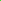

# SVG for Programmers




## What I Wish Someone Had Told Me

The first few times I looked at SVG, I was very scared.
And more than a little bit frustrated.

Now that I'm finally comfortable with it, it really isn't that hard.
If you know how to modify the DOM with JavaScript and CSS, you already have a strong foundation.

Allow me to guide you through some of the most essential concepts in SVG.
There are so many features, and so much documentation, you can get lost.
That's where I got stuck.
To paraphrase [Zipf's law](https://en.wikipedia.org/wiki/Zipf%27s_law),
focus on the few most important items, and ignore the rest as long as you can.

And I can show you some pitfalls to avoid.
All the things I wish someone had told me when I first started looking at SVG.

## What is SVG?

SVG is a file format for high quality vector graphics.
It is a popular format.

The drawing primitives are very similar to those available in the html 5 canvas, and a lot of other graphics interfaces.
(I.e. stroking and filling paths.)
The big difference is that HTML 5 canvas is little more than a bitmap and you say in advance how many pixels to use.
It has almost no other memory.
If you want to modify a single element, or change the resolution, you have to take care of that yourself.
In SVG you build a _document_ out of elements and attributes, just like in HTML.
You can make small or large changes to these objects, and SVG will automatically redraw as necessary.
And you _never_ have to worry about resolution, that's all done for you automatically.

SVG is part of the HTML family.
You can embed an SVG into an HTML document, sharing the same DOM, CSS files, event handlers, screen space, etc.

## Embedding SVG into HTML

An SVG document can be used a lot of ways.
You can save an SVG file in one program, and load it in a different program, just like most image formats.

However, **the most powerful way** to use SVG is to embed an SVG document inside an HTML document.
This gives you full access to JavaScript, user interaction, and all the things you are used to in HTML.
The bulk of this document will focus on SVG embedded in HTML.

Depending on the context you might loose access to some features.
The details vary a lot.
I have a section below dedicated to making SVG files that can be loaded by any web page in an `` tag.
Another section describes how to create, modify and save SVG files from a web page.

## Elements

## \<line>

Start with a very simple, but useful tag.

### svg

include the namespace. multiple ways to show off the namespace.
Most features that are available to `HTMLElement` objects are also available to `SVGElement` objects.

lots of boilerplate
css for the size, only a suggestion for an svg file
a good place for user variables.
clip:none
show svg on top of other things, but less mouse clicks pass through.

### circle

problem with the r compared to the cx and cy.
One option is to scale things.
Start showing off transform property.

element.setAttribute() vs element.style vs element.?.baseValue.value
e.g. `colorStops[0].setAttribute("stop-color", color);` because there is no corresponding property.

### rectangle & transform

top left corner!! Fixable but annoying. Height and width cannot be negative!

A great place to show off the transform property.

### g

used with transforms.
used to make things easier to access from code, e.g. deleting everything in one group when you restart.

### Path

"Low Level" access to a path.

### Use

keep things simple
properties can't be overwritten easily
But blank properties are easy to fill in
I.e. start with the base model, and add things after you use the thing
And the base model is always hidden, so you don't have to configure it more
Makes life easier.

### \<text\>

optical sizing
baseline and centering issues
How do links look on a mac!!!?
How to draw a decent border.
`text-anchor` and ~~alignment-baseline~~ and `dominant-baseline` css properties not ~~text-align~~
hanging worked, but not top or text-top
<text> has no presentation attributes?!
need to check but i'm pretty sure I've used it on a circle with no problems.

**why to use setAttribute sometimes.**
const y = mainSvg.createSVGLength();
y.value = (index+2)\*1;
textElement.y.baseVal.initialize(y);

**and also**
https://github.com/TradeIdeasPhilip/classic-chuzzle/blob/c55b39f2c420bd78408848b24017a7947d53c9a0/src/display-output.ts#L359
This one cached some values to avoid recreating them.

svg animations vs css animations vs animation API vs animation class.

line dash array
examples of motion
Split the path at each M to make it look better.
rounded vs not rounded end caps
stroke-linejoin stroke-miterlimit

round solves a lot of problems.
Does the miter limit f with the tight bounds in a bbox()?

create in html and save as it's own document
See public/template.svg

Local \<style\> vs importing.
And check on local JavaScript vs importing.

## Other Contexts

### Using in an `` Tag.

This is the simplest way to use an SVG file.
Load it into an HTML `` tag just like you would a `*.png` or a `*.jpg`.
I.e. you can display SVG files on website just like normal.

However, the an SVG loaded in this manner will not have access to a lot of the features that I've described in this document.
In general the SVG cannot run JavaScript, interact with the user, or access any urls.
The basic visuals will look right, including animations, as long as they are done right.

Here are some suggestions for making SVGs that will work almost everywhere.

You cannot rely on any urls.

If you need css, use a `<style>` tag and include all of the CSS directly in that tag.

You cannot use an `<image>` tag.
Not even with a data url!

You have no access to JavaScript.

You cannot interact with the user.
`:hover` doesn't work.
You have no access to event handlers.

In certain specific cases I've seen these work.
You can see the syntax and other notes in [sample-1.svg](https://github.com/TradeIdeasPhilip/random-svg-tests/blob/master/public/sample-1.svg?short_path=365f33e).

Can you use an external font? **TODO** I need to try.
Can you embed an SVG font?

### Creating, modifying, and saving an SVG _file_ from HTML & JavaScript

I've got an example of this.
https://tradeideasphilip.github.io/random-svg-tests/spheres-dev.html
Scroll down to the bottom to see the \<iframe\> stuff.
That page includes a high level description of what's going on, and a pointer to the source code.

Notice that I didn't say "loading".
I've had lots of issues with that one.
I created a template for an SVG file that sits on the same server as the rest of my program.
I have complete access to that file, e.g. adding and animating elements.
But I won't have the right permissions if I try to load an SVG file from anywhere else.
That includes all the obvious hacks, like a Data URLs.

My example is a test page.
I can run a lot of my code from the console.
I can look for bugs and I can tweak all the settings.

This worked great until I started taking screenshots of my result.
That just felt icky.
I'm drawing things with SVG, I should be able to save an SVG file!
There is no built in support for saving an embedded SVG document as a file.
After a little work I found a way.
It's not in a library, yet, but it's easy to copy.

## ᠁

I find quadratics are all I need to approximate a high quality curve.
That's enough to ensure the outgoing angle of each segment perfectly matches the incoming angle of the next segment.
That avoids unexpected kinks.
As long as you're focused on looks, quadratics will cover almost everything.

I haven't looked into cubics yet.
I know they have more magic, but quadratics have really covered my needs to date.
In the worst case I've had to use twice as many quadratics to get the same quality as with cubics.

I don't really like the A command at all.
Specifying a curve can be tricky at best.
But I really ran into trouble when I tried to squish a semi-circle into a line segment in a smooth animation.
Whenever I got close to a line segment, I'd get unexpected problems and the path would jump around for a frame or two.

The limit of an ellipse is _not_ a line segment.
Sometimes I like to pretend that it is.
A Q command can do a line much more reliably than an A command.
See https://github.com/TradeIdeasPhilip/hidden-variables/blob/5f03b623f4d72a3d7e639686e476e03fee4de816/src/main.ts#L237 for the relevant code and comments.

Don't use \<style> inside an \<svg> inside an \<html>.
That will work just like a \<style> at the top of the html or css references.
I.e. it applies to the entire html including all embedded svg's
That was not what I was expecting.
It is the preferred way for a stand alone svg file.
In any case, don't forget to use the CSS syntax, e.g. `transform: translate(2px,2px) skewX(-30deg) scaleY(0.33333333);` instead of `transform: translate(2,2) skewX(-30) scaleY(0.33333333);`.

https://developer.mozilla.org/en-US/docs/Web/SVG/Attribute/paint-order
I often do this myself.
This is required to keep text readable.
paint-order="stroke" id="stroke-under"

`$0.rotate.baseVal.appendItem(1)` -> `TypeError: parameter 1 is not of type 'SVGNumber'.`
This is an example of where I _can_ use typed objects but it's so much trouble,
it's easier just to `setAttribute()`.

```
function resetSpacing() {
  const length = text.ownerSVGElement.createSVGLength();
  length.value = 10;
  list.initialize(length);
  printList();
}
```

(from https://developer.mozilla.org/en-US/docs/Web/API/SVGLengthList)
I was hoping it would be easier for a list of numbers than it was for a list of lengths.
But, as shown in the error message above, an [SVGNumberList](https://developer.mozilla.org/en-US/docs/Web/API/SVGNumberList) is **not** a list of of numbers. It is a list of [SVGNumber](https://developer.mozilla.org/en-US/docs/Web/API/SVGNumber) objects. So I'd have to do something similar to the example above even in this simple case. This is when I decided it would be easier to just use `setAttribute()`.

### Common SVG Issues in Safari and Best Practices

Safari’s SVG rendering has improved over the years, but it still lags behind Chrome and Firefox in consistency, especially for dynamic or animated SVGs. While there isn’t a single definitive list of all SVG issues in Safari (issues evolve with browser updates), the web development community has documented recurring problems through blog posts, Stack Overflow threads, and browser bug trackers like WebKit’s Bugzilla. Below is a distilled list of well-known issues and best practices relevant to your project (e.g., inline SVGs, animations, and aspect ratio preservation).

#### 1. Aspect Ratio and Sizing Issues

- **Issue**: Safari often ignores the `viewBox` aspect ratio for inline SVGs, stretching them to the parent container’s width unless intrinsic dimensions are explicitly set. This is what you experienced with your SVGs taking the full parent width, while Chrome preserved the aspect ratio.
- **Best Practice**:
  - Always set `width` and `height` attributes on the `<svg>` element to match the `viewBox` aspect ratio. For example, if your `viewBox` is `"0 0 100 200"` (aspect ratio 1:2), set `width="100"` and `height="200"`. Then use CSS (`width: auto; height: auto; max-height: 30vh;`) to scale the SVG proportionally. This ensures Safari respects the aspect ratio like Chrome does.
  - Use `preserveAspectRatio="xMidYMid meet"` (which you already do) to ensure the SVG content fits within the viewport without cropping, but note that this alone isn’t enough in Safari without intrinsic dimensions.

#### 2. Animation Issues with CSS Motion Path (`offset-path`)

- **Issue**: Safari has inconsistent support for animating `offset-path` and `offset-distance`, especially when the path is set dynamically via CSS custom properties (like your `--css-path`). You saw this with `#tauFollowingPathSample`, where the `<text>` elements didn’t move in Safari despite the animation running.
- **Best Practice**:
  - Avoid setting `offset-path` via CSS custom properties for animations. Instead, hardcode the path in the CSS (`offset-path: path("M ...")`) or set it directly on the element’s style in JavaScript (`element.style.offsetPath = "path('M ...')"`).
  - If animations fail, consider using JavaScript to animate `offset-distance` (as a fallback), since Safari supports static `offset-path` positioning but may struggle with dynamic updates during animations.

#### 3. Dynamic SVG Updates

- **Issue**: Safari sometimes fails to re-render SVGs after dynamic updates, such as changing attributes or styles (e.g., updating a `<path>`’s `d` attribute or a CSS property). This can cause animations to stall or elements to appear static until a user interaction forces a redraw.
- **Best Practice**:
  - Force a repaint in Safari by toggling a CSS property (e.g., `element.style.display = 'inline';`) after updating the SVG.
  - When updating SVG content dynamically, ensure the SVG is fully re-rendered by removing and re-adding it to the DOM if necessary (`parent.removeChild(svg); parent.appendChild(svg);`).

#### 4. `fill-rule` Behavior

- **Issue**: Safari may interpret `fill-rule` differently for complex paths with inflection points (like your Lissajous curves), sometimes defaulting to `evenodd`-like behavior even when set to `nonzero`. You noticed this difference between Lissajous curves and pentagram/heptagram curves.
- **Best Practice**:
  - Explicitly set `fill-rule="nonzero"` or `fill-rule="evenodd"` on your `<path>` elements to ensure consistent behavior across browsers.
  - For complex paths, test in multiple browsers to confirm the rendering matches your expectations, as Safari’s path-filling algorithm can differ subtly from Chrome’s.

#### 5. Performance with Large SVGs

- **Issue**: Safari can be slower to render large or complex SVGs, especially with animations or many elements, leading to choppy performance.
- **Best Practice**:
  - Simplify paths where possible (e.g., reduce the number of points in parametric curves like Lissajous).
  - Use `will-change: transform` on animated elements to hint at optimization, but apply it sparingly to avoid memory issues.

#### 6. Text Rendering in SVGs

- **Issue**: Safari sometimes renders SVG `<text>` elements inconsistently, especially with custom fonts or animations (like your `#tauFollowingPathSample`).
- **Best Practice**:
  - Use widely supported fonts or embed font data directly in the SVG if needed.
  - For animations involving `<text>`, ensure the parent SVG has a defined size (via `width` and `height` attributes) to avoid layout shifts that Safari might mishandle.